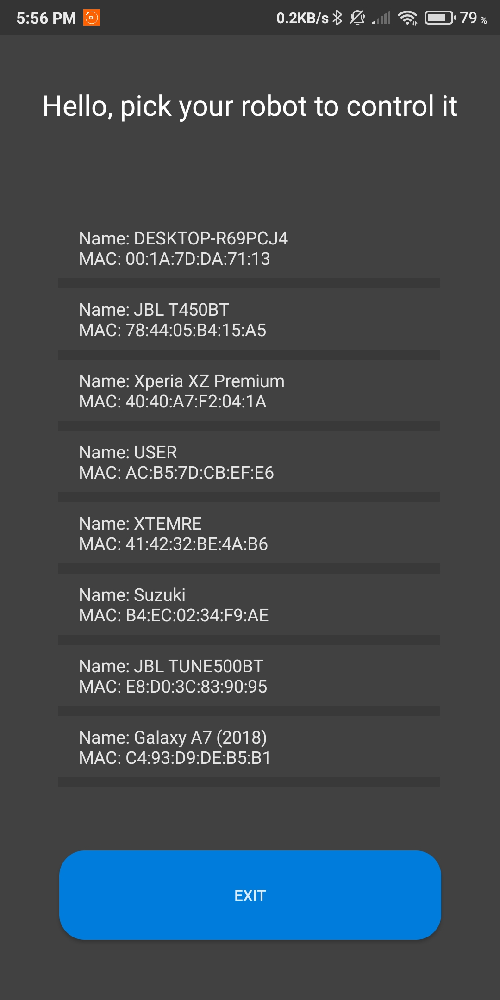
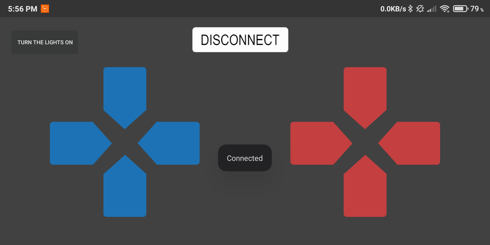
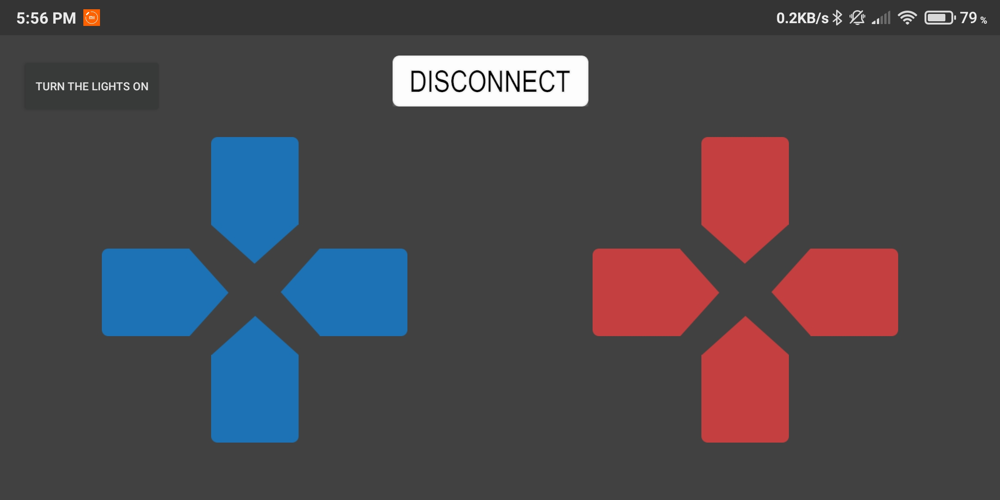
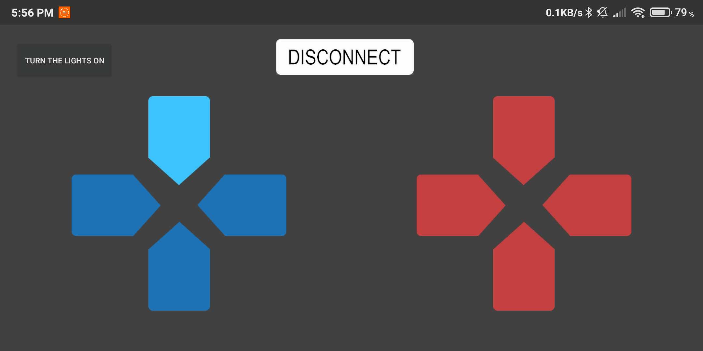
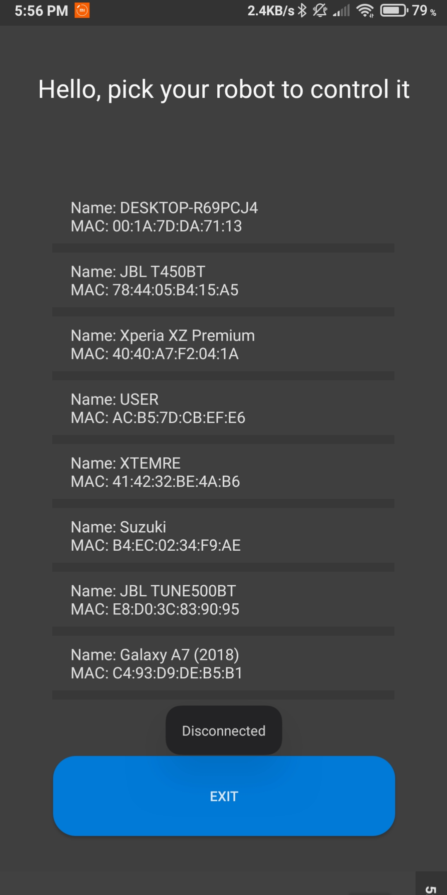

# RobotControlAndroidApp
## Application created to control self made robot-excavator

After successful connection app moves to controls

Where we can control our robot

After all we disconnect and can exit from app

